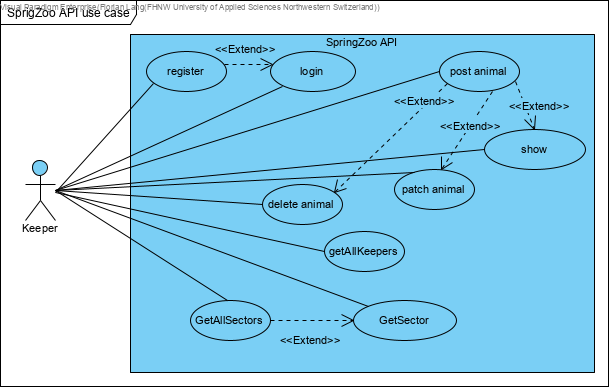
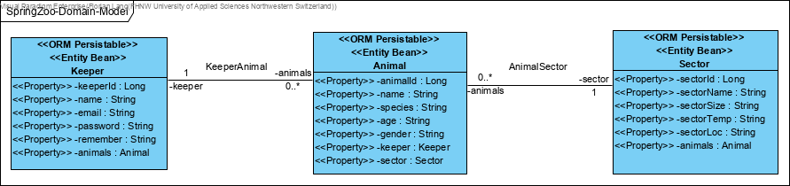
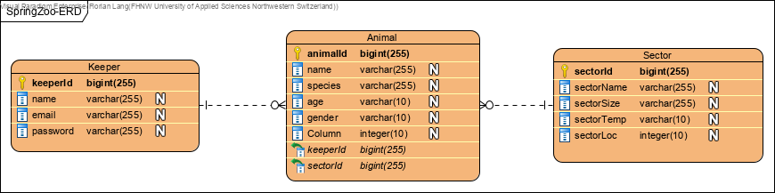
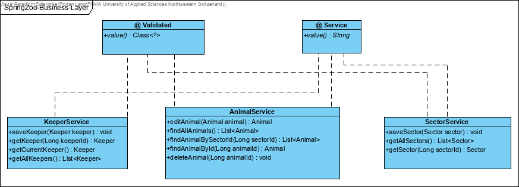
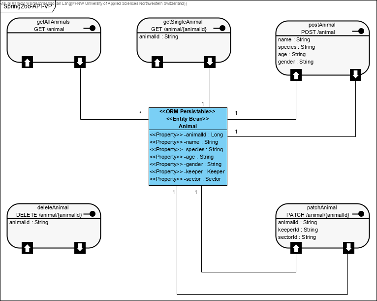

# SpringZoo Boot API Documentation

Documentation for SpringZoo API including Swagger/OpenAPI

[](http://www.apache.org/licenses/LICENSE-2.0.html)
[](https://heroku.com/deploy)

#### Contents:
- [Analysis](#analysis)
  - [Scenario](#scenario)
  - [Use Case](#use-case)
- [Design](#design)
  - [Endpoint Prototype](#endpoint-prototype)
  - [Data Access / Persistence Layer](#data-access--persistence-layer)
  - [Business Layer](#business-layer)
  - [Service Layer / API](#service-layer--api)
- [Deployment](#deployment)

## Analysis

### Scenario

SpringZoo is a small fictional CRM tool that let's zookeepers see and manage animal data. This includes the sector where the animals are currently situated.

### Use Case

- **UC-1 [Login on SpringZoo]:** Keepers are able to log-in using an email address and password. As an extension, new keepers may register first. (**Not yet active, I don't know how to realize this yet**). As an extension to register (UC-2).
- **UC-2 [Register on SpringZoo]:** Keepers can register to get an account (profile) to access the SpringZoo system.
- **UC-3 [Post animal]:** Keepers can create data entries for animals.
- **UC-4 [Delete animal]:** Keepers may delete data entries for animals. As an extension they can create animals (UC-3)
- **UC-5 [Patch animal]:** Keepers may patch data entries for animals, this includes moving the animal entries to another sector and/or keeper. As an extension they can create animals (UC-3)
- **UC-6 [Show]:** Keepers may retrieve Single animal data entries and Lists, this includes GetSingleAnimal, GetAllAnimals, GetAllAnimalsFromKeeper, GetAllAnimalsInSector. As an extension they can create animals (UC-3)
- **UC-7 [ShowAllKeepers]:** Keepers may retrieve a complete List of other keepers.
- **UC-8 [GetAllSectors]:** Keepers may retrieve a complete List of all Zoo sectors.
- **UC-9 [GetSector]:** Keepery may retrieve a single sector. As an extension to retrieve a List of all the sectors (UC-8).

## Design

### Endpoint Prototype
**Path**: [`/api/animal`](/api/customer) 

**Method:** `POST`

**Sample Request**  • *Header:* `Content-Type: application/json` • *Body:*

```JSON
{
  "age": "string",
  "gender": "string",
  "name": "string",
  "species": "string"
}
```

• *Optional:* `...`
  
**Success Response**  • *Code:* `200 OK` • *Sample Body:*

```JSON
{
  "animalId": 6,
  "name": "string",
  "species": "string",
  "age": "string",
  "gender": "string"
}
```

**Error Response** • *Code:* `404 NOT FOUND`

-------------------------------------------------------------------------------------------

**Path**: [`/api/keeper`](/api/keeper)
**Method:** `POST`

```JSON

{
  "email": "email-string",
  "name": "string",
  "password": "string",
  "remember": "string"
}

```
• *Optional:* `...`

**Success Response**  • *Code:* `200 OK` • *Sample Body:*

```JSON

{
  "email": "zoo@zoo.ch",
  "name": "string",
  "password": "string",
  "remember": "string"
}

```

**Error Response** • *Code:* `406`

```JSON
{
  "timestamp": "2019-11-09T14:20:43.560+0000",
  "status": 406,
  "error": "Not Acceptable",
  "message": "Please provide a valid e-mail.",
  "path": "/api/keeper"
}
```

**Error Response** • *Code:* `404 NOT FOUND`


### Data Access / Persistence Layer

The `rocks.process.acrm.data.domain` package contains the following domain objects / entities including getters and setters:



This would be the ERD representation of the domain model:



### Business Layer

The `rocks.process.acrm.business.service` package contains classes of the following business services:




### Service Layer / API

On the service layer, the API for customer management has been realised using the REST style as depicted in the following:



Further can be seen using the Swagger-UI.

## Deployment

This spring boot application can be deployed to Heroku by adding the following `Procfile` to the project root:
```console
web: java -Dserver.port=$PORT $JAVA_OPTS -jar /target/*.jar
```

Finally the Swagger-UI can be access using the Heroku app specific address such as: `https://***.herokuapp.com/swagger-ui.html`
